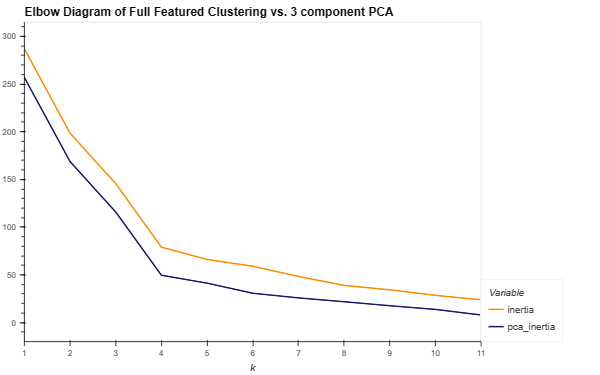
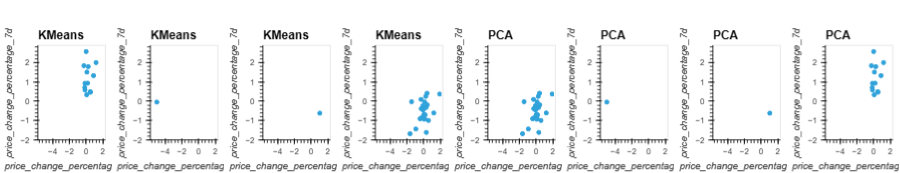
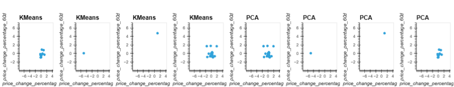
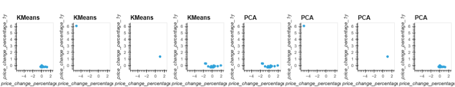

# CryptoClustering

## Intro
Use python and scikitlearn library to segment crypto currencies into like clusters. Python and the scikitlearn library are used to produce unsupervised machine learning models. A KMeans model is used both with a Full-Featured and 3 component PCA to compare. 

## Data
Within Resources Folder:
- [Data](https://github.com/StarkArk/UnsupervisedML_CryptoClustering/blob/main/Resources/crypto_market_data.csv) - CSV file of 42 crypto currencies

## Optimal Number of Clusters
### Elbow Curves:

- The plot clearly shows that 4 clusters is optimal for both the full-featured and pca analysis.

### Comparing Clusters for Full-Feature and PCA:

- Clusters are primarily the same for the Full-Featured and PCA. Only a small loss occurred when using a 3 component PCA.

## Conclusion

### Primary questions answered:

- The Best value for k?	
**4**

- The total explained variance for the three principal components?
**89.5%**

- What is the impact of using fewer features to cluster the data using K-Means? \
**Some loss of information between the full featured and the three dimensional PCA does occur. But, looking at the graphs the clusters mostly match. Two clusters are an exact match, while the other two have only a few points of mismatch. Generally, this seems like a fairly good result between the two methods.**

